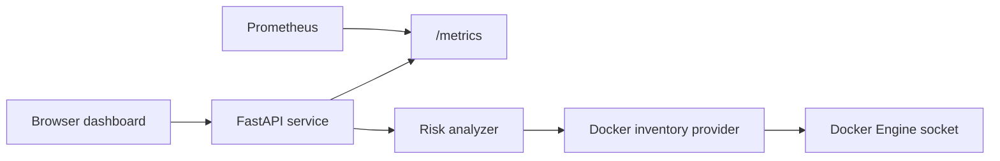
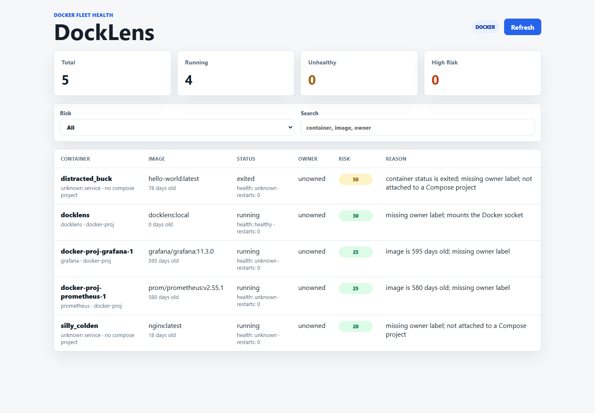
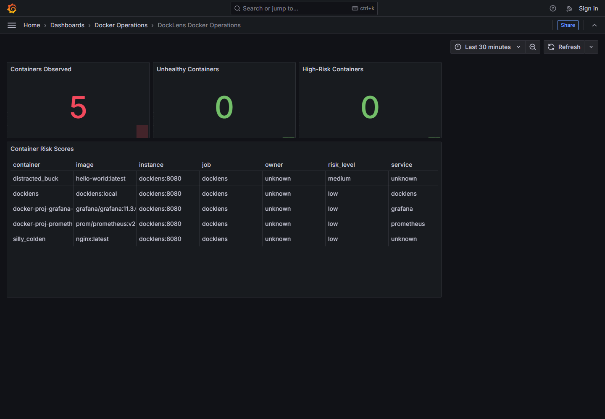

# DockLens

DockLens is a self-hosted Docker fleet health and drift monitor for small teams running Docker or Docker Compose on VMs.

It solves a real DevOps problem: Compose-based hosts often grow into quiet production systems with no clear inventory, no health summary, no restart-loop visibility, and no easy way to spot risky containers. DockLens reads Docker metadata, scores operational risk, shows a clean dashboard, and exposes Prometheus metrics.

## Why this is portfolio-worthy

- Docker-native service that inspects a Docker host through the Engine API.
- Secure container defaults: non-root user, read-only filesystem, dropped capabilities, health checks.
- Multi-stage Dockerfile with dependency isolation.
- Production Compose file with optional Prometheus and Grafana profile.
- CI/CD pipeline for linting, tests, image builds, Trivy scanning, SBOM/provenance-friendly image publishing.
- Clean Python architecture: API layer, provider layer, analyzer layer, static dashboard.
- Demo mode works without Docker so reviewers can still try the app quickly.

## Architecture



## Screenshots





## Quick Start

Run with Docker Compose:

```bash
docker compose up --build
```

On Linux, set the Docker socket group so the non-root container can read Docker metadata:

```bash
export DOCKER_GID=$(getent group docker | cut -d: -f3)
docker compose up --build
```


PowerShell:

```powershell
$env:PORT = "8081"
docker compose up --build
```

If Docker Desktop is installed but `docker` is not on PATH on Windows, add this directory to PATH or call `docker.exe` from it directly:

```text
C:\Users\<you>\AppData\Local\Programs\DockerDesktop\resources\bin
```

Run the observability profile:

```bash
docker compose --profile observability up --build
```


## Local Development

```bash
python -m venv .venv
source .venv/bin/activate
pip install -r requirements.txt -r requirements-dev.txt
uvicorn app.main:app --reload --host 0.0.0.0 --port 8080
```

On Windows PowerShell:

```powershell
py -m venv .venv
.\.venv\Scripts\Activate.ps1
pip install -r requirements.txt -r requirements-dev.txt
uvicorn app.main:app --reload --host 0.0.0.0 --port 8080
```

Use demo mode when Docker is unavailable:

```bash
DEMO_MODE=true uvicorn app.main:app --reload --port 8080
```

## API

| Endpoint | Purpose |
| --- | --- |
| `GET /` | Dashboard |
| `GET /healthz` | Liveness check |
| `GET /readyz` | Docker/provider readiness |
| `GET /api/containers` | Detailed container inventory |
| `GET /api/summary` | Fleet summary and top risks |
| `GET /metrics` | Prometheus text metrics |

## Risk Scoring

DockLens assigns each container a score from 0 to 100. It raises the score for:

- unhealthy, exited, or restarting containers
- restart loops
- old images
- missing ownership labels
- containers outside Compose projects
- privileged containers
- Docker socket mounts

Recommended labels:

```yaml
labels:
  com.docklens.owner: platform
  com.docklens.service: payments-api
  com.docklens.runbook: https://wiki.example.com/runbooks/payments-api
```

## Production Deployment

1. Publish the image from GitHub Actions to GHCR.
2. Copy `deploy/docker-compose.prod.yml` to your Docker host.
3. Set `IMAGE=ghcr.io/<owner>/docklens:<tag>` and `DOCKER_GID=$(getent group docker | cut -d: -f3)`.
4. Run:

```bash
docker compose -f deploy/docker-compose.prod.yml up -d
```

Or use:

```bash
./deploy/deploy.sh ghcr.io/<owner>/docklens:<tag>
```

PowerShell:

```powershell
.\deploy\deploy.ps1 -Image ghcr.io/<owner>/docklens:<tag>
```

For public or shared environments, put DockLens behind a reverse proxy with authentication. See `deploy/reverse-proxy/README.md` and `deploy/docker-compose.proxy.yml`.

## Portfolio Assets

- Case study: `docs/CASE_STUDY.md`
- Demo guide: `docs/DEMO.md`
- Deployment checklist: `docs/DEPLOYMENT_CHECKLIST.md`
- Screenshot folder: `docs/images/`
- Pull request template: `.github/pull_request_template.md`
- Issue templates: `.github/ISSUE_TEMPLATE/`

## Security Note

DockLens mounts `/var/run/docker.sock` read-only so it can inspect containers. Docker socket access is powerful even when mounted read-only. Run DockLens only on hosts you control, protect the dashboard behind your internal network or reverse proxy, and avoid exposing it directly to the public internet.

## Project Structure

```text
app/
  api/              API routes
  core/             Docker provider, models, scoring, metrics
  static/           Dashboard assets
deploy/            Production deployment files
observability/     Prometheus configuration
tests/             Unit tests
.github/workflows/ CI/CD pipeline
```
