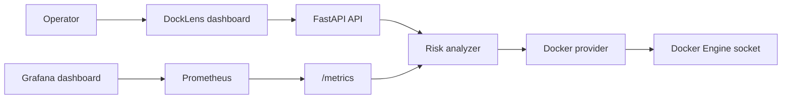

# DockLens Case Study

## Problem

Many teams run important services on single Docker hosts or Compose-based VMs. These hosts are easy to start and hard to operate over time. Containers accumulate, ownership gets unclear, health checks are inconsistent, and risky workloads can sit unnoticed.

DockLens turns a Docker host into a readable operational inventory. It answers:

- What is running on this host?
- Which containers are unhealthy, exited, or restarting?
- Which services have weak ownership metadata?
- Which containers look risky because they are privileged or mount the Docker socket?
- Can this health state be scraped by Prometheus?

## Solution

DockLens is a Docker-native FastAPI service. It reads Docker Engine metadata, computes an operational risk score for each container, exposes a dashboard, and publishes Prometheus metrics.

The app can run in two modes:

- Docker mode: reads the local Docker Engine socket.
- Demo mode: uses realistic sample data for quick review without Docker access.

## Architecture

## DevOps Highlights

- Multi-stage Dockerfile with a slim runtime image.
- Non-root container user.
- Read-only filesystem and tmpfs for runtime scratch space.
- Dropped Linux capabilities and `no-new-privileges`.
- Health check in Dockerfile and Compose.
- Configurable Compose port for local port conflicts.
- Optional observability profile with Prometheus and Grafana.
- Pre-provisioned Grafana datasource and dashboard.
- CI/CD with linting, tests, Docker Buildx, GHCR publishing, SBOM/provenance, and Trivy scanning.
- Production Compose file and deployment scripts.
- Reverse proxy examples for basic authentication.

## Security Tradeoffs

DockLens needs access to Docker metadata, so it mounts `/var/run/docker.sock`. Docker socket access is powerful. Even read-only mounts should be treated carefully because the Docker API can expose sensitive runtime information.

Mitigations:

- Run DockLens only on trusted hosts.
- Keep the service internal or behind VPN/reverse proxy authentication.
- Use the included Caddy or Nginx examples for basic auth.
- Run the app as a non-root user.
- Drop capabilities and prevent privilege escalation.
- Avoid storing secrets in labels, container names, or image tags.

## Risk Scoring

Each container receives a score from 0 to 100. The score increases for:

- unhealthy or exited state
- restart loops
- stale images
- missing owner labels
- workloads outside Compose projects
- privileged containers
- Docker socket mounts

This is intentionally explainable. Operators can see exactly why a container is risky and what metadata or runtime behavior should change.

## Deployment Flow

1. Developer opens a pull request.
2. CI installs dependencies, runs linting, and runs tests.
3. Docker Buildx builds the runtime image.
4. Trivy scans the image and uploads SARIF results.
5. Main branch or tags publish the image to GHCR.
6. A VM pulls the immutable image and runs it through production Compose.
7. Prometheus scrapes `/metrics`; Grafana displays the dashboard.

## What I Would Improve Next

- Add OIDC-based auth in front of the dashboard.
- Add alert rules for high-risk and unhealthy containers.
- Add image digest drift detection against expected Compose files.
- Add Slack or webhook notifications.
- Add multi-host support through remote Docker contexts.
